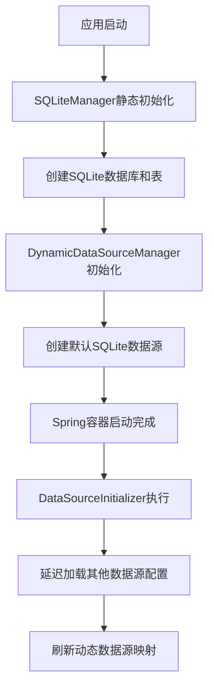
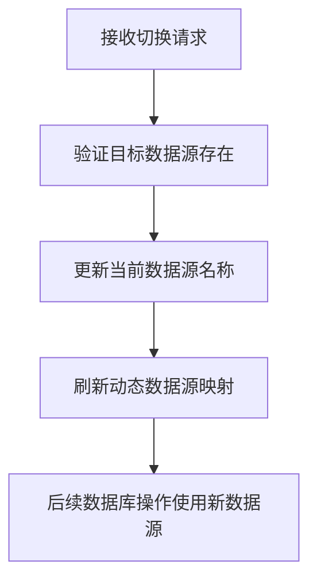
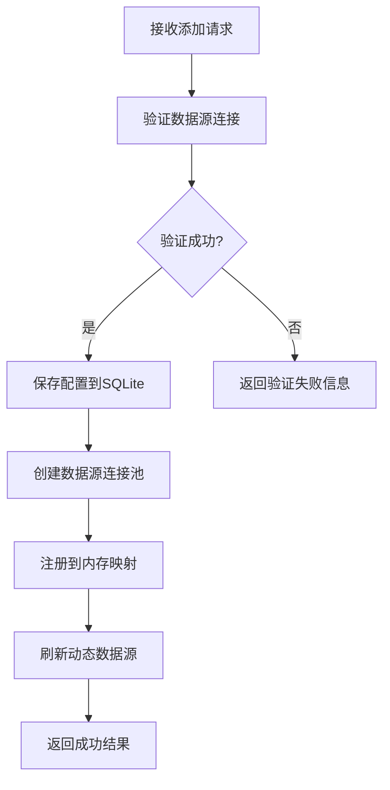

# Pomelo Framework 项目结构

## 📁 项目总览

```
pomelo-framework/
├── pomelo-common/                    # 公共模块
│   ├── pomelo-common-core/          # 核心模块
│   ├── pomelo-common-dao/           # 数据访问层模块 ⭐
│   ├── pomelo-common-facade/        # 接口定义模块
│   ├── pomelo-common-junit/         # 测试工具模块
│   ├── pomelo-common-security/      # 安全模块
│   └── pomelo-common-util/          # 工具类模块
├── pomelo-demo/                     # 示例项目 ⭐
└── docs/                           # 文档
```

## 🎯 核心模块详解

### pomelo-common-dao（数据访问层）

这是动态数据源脚手架的核心模块，提供了完整的多数据源管理功能。

```
pomelo-common-dao/
├── src/main/java/com/cuckoo/pomelo/common/dao/
│   ├── config/                      # 配置类
│   │   ├── CustomDataSourceAutoConfiguration.java    # 数据源自动配置
│   │   ├── DataSourceInitializer.java               # 数据源初始化器
│   │   └── MyBatisConfig.java                       # MyBatis配置
│   ├── constants/                   # 常量定义
│   │   └── DataSourceConstants.java                # 数据源常量
│   ├── controller/                  # REST API控制器
│   │   └── DataSourceController.java               # 数据源管理API
│   ├── datasource/                  # 动态数据源核心
│   │   ├── DynamicDataSource.java                  # 动态数据源实现
│   │   ├── DynamicDataSourceManager.java           # 数据源管理器
│   │   └── DataSourceValidationResult.java         # 数据源验证结果
│   ├── entity/                      # 实体类
│   │   ├── BaseEntity.java                         # 基础实体
│   │   └── DataSourceConfig.java                   # 数据源配置实体
│   ├── mapper/                      # MyBatis Mapper
│   │   └── DataSourceConfigMapper.java             # 数据源配置Mapper
│   ├── service/                     # 业务服务
│   │   └── DataSourceManagementService.java        # 数据源管理服务
│   ├── sqlite/                      # SQLite管理
│   │   └── SQLiteManager.java                      # SQLite数据库管理器
│   └── typehandler/                 # MyBatis类型处理器
│       └── CommonEnumTypeHandler.java              # 通用枚举处理器
└── src/main/resources/
    ├── META-INF/
    │   └── spring.factories                        # Spring自动配置
    ├── application.yml                             # 配置文件
    └── mybatis-config.xml                          # MyBatis配置
```

### pomelo-demo（示例项目）

演示如何使用动态数据源脚手架的示例项目。

```
pomelo-demo/
├── src/main/java/com/cuckoo/pomelo/demo/
│   ├── controller/
│   │   └── DemoController.java                     # 示例控制器
│   ├── entity/
│   │   └── User.java                              # 用户实体
│   ├── mapper/
│   │   └── UserMapper.java                        # 用户Mapper
│   ├── service/
│   │   └── UserService.java                       # 用户服务
│   └── DemoApplication.java                       # 启动类
└── src/main/resources/
    └── application.yml                             # 应用配置
```

## 🔧 核心组件说明

### 1. 数据源管理器 (DynamicDataSourceManager)

**职责**：
- 管理所有数据源的生命周期
- 提供数据源的增删改查功能
- 处理数据源的动态切换
- 维护数据源连接池

**特点**：
- 单例模式，全局唯一实例
- 支持运行时动态添加/移除数据源
- 自动初始化默认SQLite数据源
- 延迟加载避免循环依赖

### 2. 动态数据源 (DynamicDataSource)

**职责**：
- 继承Spring的AbstractRoutingDataSource
- 根据当前上下文动态路由到正确的数据源
- 支持数据源映射的实时刷新

**特点**：
- 重写determineTargetDataSource方法实现动态查找
- 支持运行时刷新数据源映射
- 提供详细的调试日志

### 3. 数据源管理服务 (DataSourceManagementService)

**职责**：
- 提供数据源管理的业务接口
- 处理数据源配置的CRUD操作
- 避免循环依赖问题

**特点**：
- 直接操作SQLite避免MyBatis循环依赖
- 统一的异常处理和日志记录
- 完整的数据源生命周期管理

### 4. SQLite管理器 (SQLiteManager)

**职责**：
- 管理本地SQLite数据库
- 自动创建必要的表结构
- 提供数据库连接

**特点**：
- 静态初始化，应用启动时自动创建数据库
- 使用常量统一管理SQL语句
- 自动插入示例数据

## 🚀 工作流程

### 1. 应用启动流程



### 2. 数据源切换流程



### 3. 添加数据源流程



## 📋 API接口

### 数据源管理API

| 方法 | 路径 | 说明 |
|------|------|------|
| GET | `/api/datasource/list` | 获取所有数据源配置 |
| GET | `/api/datasource/current` | 获取当前数据源名称 |
| GET | `/api/datasource/status` | 获取数据源状态信息 |
| POST | `/api/datasource/add` | 添加新数据源 |
| PUT | `/api/datasource/update` | 更新数据源配置 |
| DELETE | `/api/datasource/delete/{id}` | 删除数据源 |
| POST | `/api/datasource/switch/{name}` | 切换数据源 |
| POST | `/api/datasource/enable/{name}` | 启用数据源 |
| POST | `/api/datasource/default/{name}` | 设置默认数据源 |

### 示例API

| 方法 | 路径 | 说明 |
|------|------|------|
| GET | `/public/datasource/info` | 获取当前数据源信息 |
| GET | `/public/datasource/test` | 测试数据源连接 |
| GET | `/public/users` | 查询用户列表 |
| POST | `/public/users` | 创建用户 |
| PUT | `/public/users/{id}` | 更新用户 |
| DELETE | `/public/users/{id}` | 删除用户 |

## 🔧 配置说明

### application.yml 配置

```yaml
# MyBatis配置
mybatis:
  config-location: classpath:mybatis-config.xml
  mapper-locations: classpath:mapper/**/*.xml
  type-aliases-package: com.cuckoo.pomelo.demo.entity

# 通用Mapper配置
mapper:
  mappers:
    - io.mybatis.mapper.Mapper
  not-empty: true
  identity: SQLITE  # 根据当前数据源类型调整

# 分页插件配置
pagehelper:
  helper-dialect: sqlite  # 根据当前数据源类型调整
  reasonable: true
  support-methods-arguments: true
  params: count=countSql
```

### 数据源常量配置

所有数据源相关的常量都定义在 `DataSourceConstants` 类中：

- 数据库连接参数
- 连接池配置
- SQL语句模板
- 状态常量

## 🎯 设计原则

1. **单一职责**：每个类都有明确的职责边界
2. **开闭原则**：支持扩展新的数据源类型，无需修改现有代码
3. **依赖倒置**：通过接口和抽象类降低耦合
4. **配置分离**：配置信息统一管理，便于维护
5. **异常安全**：完善的异常处理和资源管理

## 🔍 扩展点

1. **新数据源类型**：在 `DynamicDataSourceManager` 中添加新的数据源创建逻辑
2. **连接池配置**：在 `DataSourceConstants` 中添加新的连接池参数
3. **数据源验证**：扩展 `validateDataSource` 方法支持更多验证规则
4. **监控指标**：添加数据源使用情况的监控和统计
5. **配置加密**：对敏感配置信息进行加密存储